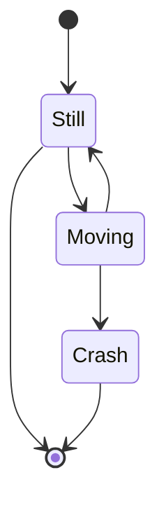

# multi-app

You can render UML diagrams using [Mermaid](https://mermaidjs.github.io/).

```mermaid
graph TD;
    A-->B;
    A-->C;
    B-->D;
    C-->D;
```

```mermaid
stateDiagram
	[*] --> Still
	Still --> [*]

	Still --> Moving
	Moving --> Still
	Moving --> Crash
	Crash --> [*]

```
