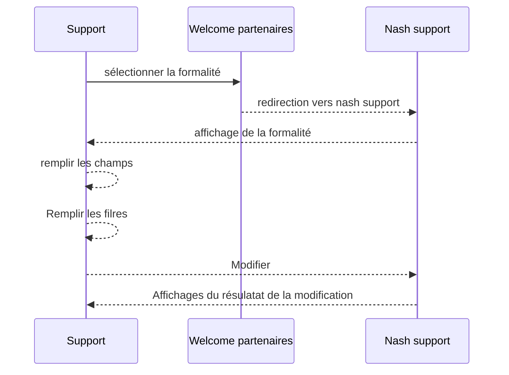

# multi-app

```mermaid
sequenceDiagram
Support ->> Welcome partenaires : sélectionner la formalité
Welcome partenaires -->>Nash support : redirection vers nash support
Nash support -->> Support : affichage de la formalité
Support -->> Support : remplir les champs
Support  -->> Support : Remplir les filres
Support -->> Nash support : Modifier
Nash support -->> Support : Affichages du résulatat de la modification
```
